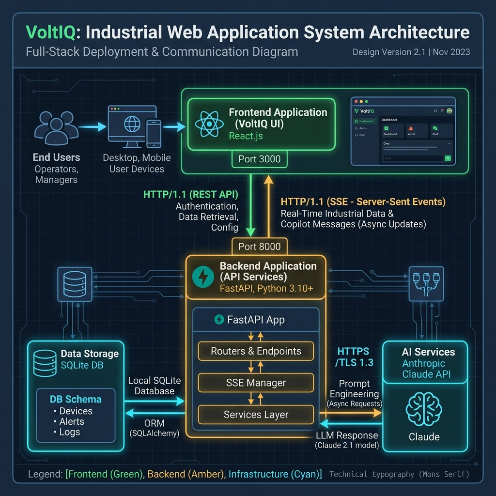

# VoltIQ Platform Technical Documentation

**VoltIQ** is a production-grade AI Intelligence Platform for Industrial EV Asset Management and Supply Chain Resilience, custom-built for the **ET AI Hackathon 2026 (Problem Statement 3)**. This document provides a complete technical blueprint of the architecture, database designs, AI capabilities, solved system bugs, and setup procedures.

---

## 🏛️ System Architecture

VoltIQ is designed with a decoupled full-stack architecture optimized for high-performance telemetry processing, live network visualization, and asynchronous AI operations:

---

## 🗄️ Database Design (SQLite via SQLAlchemy)

The database schema models EV telemetry traces, conventional ICE fleets, and multi-tier supplier flow graphs:

### 1. EV Vehicles (`vehicles` table)
- `id` (String, PK): Asset identifier (e.g., `EV-001`).
- `type` (String): Heavy Truck, Forklift, Mining Loader.
- `status` (String): Active, Charging, Maintenance.
- `battery_capacity_kwh` (Float): Physical capacity.
- `current_soc` (Float): State of Charge (%).
- `current_soh` (Float): State of Health (%).
- `cycle_count` (Integer): Total battery cycles.
- `temperature_c` (Float): Cell temperature.
- `voltage_v` (Float): BMS pack voltage.
- `current_a` (Float): Operating current.
- `has_thermal_anomaly` (Boolean): Anomaly deviance flag.
- `next_maintenance_date` (String): Scheduled date.
- `rul_days` (Integer): Remaining Useful Life projection.
- `health_score` (Integer): Health grade (0-100).

### 2. Telemetry History (`telemetry_history` table)
- `id` (Integer, PK): Autoincrement log ID.
- `vehicle_id` (String, FK): Linked EV vehicle.
- `timestamp` (String): Isoformat logging time.
- `soc` (Float) / `soh` (Float) / `temperature` (Float) / `voltage` (Float) / `current` (Float) / `cycle_count` (Integer).

### 3. ICE Fleet (`ice_vehicles` table)
- `id` (String, PK): Replaced asset ID (e.g., `ICE-001`).
- `type` (String) / `daily_km` (Float) / `payload_tons` (Float) / `dwell_time_hours` (Float).
- `route_type` (String): Urban, Highway, Off-road.
- `fuel_efficiency_km_l` (Float) / `annual_utilization_km` (Float) / `emission_factor_g_co2_km` (Float).

### 4. Suppliers & Flows (`suppliers` & `supplier_flows` tables)
- **Suppliers**: `id` (PK), `name`, `tier` (1-3), `material` (Lithium, Cobalt, Nickel, Cells), `location`, `risk_score`, `geopolitical_risk`, `concentration_risk`, `quality_deviation`, `status` (Active, Flagged, Critical).
- **Supplier Flows**: `id` (PK), `source_id` (FK), `target_id` (FK), `material`, `volume_tpa` (Tons Per Annum flow).

---

## 💡 Core Modules & Business Logic

### 1. EV Asset Performance Management (APM)
- **Degradation Model**: Performs NumPy curve-fitting on capacity fade over charge cycles. RUL is projected based on degradation slopes, estimating when the asset SOH will cross the critical $70\%$ threshold.
- **BMS Anomaly Detection**: Evaluates temperature and voltage spikes. Assets deviances exceeding $2\sigma$ from the fleet average are flagged for immediate thermal runaway risks.

### 2. Fleet Electrification Scorer
- **EV Suitability Score**: Computes readiness grades ($0\text{ to }100$) by cross-referencing route daily distance against available depot dwell charging windows.
- **TCO Delta Assessment**: Evaluates diesel displacement savings against electricity charging tariffs, infrastructure amortizations, and expected battery replacements.

### 3. Supply Chain Resiliency Graph
- **directed Flow Graph**: Custom-built interactive SVG Node-Edge directed canvas groupings nodes horizontally by Tier (Tier 3 Mines left $\rightarrow$ Tier 2 Refiners center $\rightarrow$ Tier 1 Assemblies right).
- **Propagation Model**: Geopolitical corridor delays or Tier 3 quality deviation metrics automatically propagate downstream to flag affected assembly components.

### 5. Carbon Tracker
- **Scope Balance**: Maps tailpipe diesel offsets (Scope 1) against charging grid intensity footprint (Scope 3).
- **Triage Priority**: Ranks conventional ICE fleets by highest emission saving efficiency to identify optimal electrification candidates.

### 6. Conversational Copilot
- **Anthropic Claude 3.5 Agent**: Configured with a system safety guard prompt to block off-topic queries and prompt injection.
- **Multi-Tool Calling**: Invokes functions (`get_fleet_health`, `get_supply_chain_risks`, `get_carbon_metrics`) dynamically based on context.
- **SSE Streaming**: Pipes raw Claude token streams into standard SSE data chunks (`data: {"type": "text", "content": "..."}\n\n`).

---

## 🔧 Resolved Issues & Configurations

### 1. Database Seeder Fixes
- **BMS Random Range**: Fixed a `ValueError: low >= high` inside [bms_generator.py](file:///c:/Users/MOULENDRA%20BALAJI/Downloads/ET_AI_HACKTHON_2026/voltiq/backend/data/generators/bms_generator.py#L22) when seeding small cycle datasets.
- **Model Initializer**: Mapped `asset_id` keys to SQL `id` columns during `Vehicle` construction inside [db_seeder.py](file:///c:/Users/MOULENDRA%20BALAJI/Downloads/ET_AI_HACKTHON_2026/voltiq/backend/data/generators/db_seeder.py#L24-L27).

### 2. Port Customization
- Assigned React dev server to port `3000` via [vite.config.ts](file:///c:/Users/MOULENDRA%20BALAJI/Downloads/ET_AI_HACKTHON_2026/voltiq/frontend/vite.config.ts#L6-L8) to free default Vite ports.

### 3. Unified TSConfig
- Eliminated project references (`tsconfig.app.json` & `tsconfig.node.json`) and compiled a single flat [tsconfig.json](file:///c:/Users/MOULENDRA%20BALAJI/Downloads/ET_AI_HACKTHON_2026/voltiq/frontend/tsconfig.json) mapping both browser and node files. This fixes type resolution errors and built-in editor schema warnings (such as `erasableSyntaxOnly` conflicts).

---

## 🚀 Setup & Startup Checklist

1. **Verify Ports**: Ensure local ports `8000` and `3000` are free.
2. **Configure Keys**: Add your Anthropic API key to the root `.env` file (`ANTHROPIC_API_KEY`).
3. **Database Setup**: Database seeds automatically on startup if `voltiq.db` is missing.
4. **Launch**: Double-click [start.bat](file:///c:/Users/MOULENDRA%20BALAJI/Downloads/ET_AI_HACKTHON_2026/voltiq/start.bat) to launch both services. Open `http://localhost:3000` in the browser to view the system.
